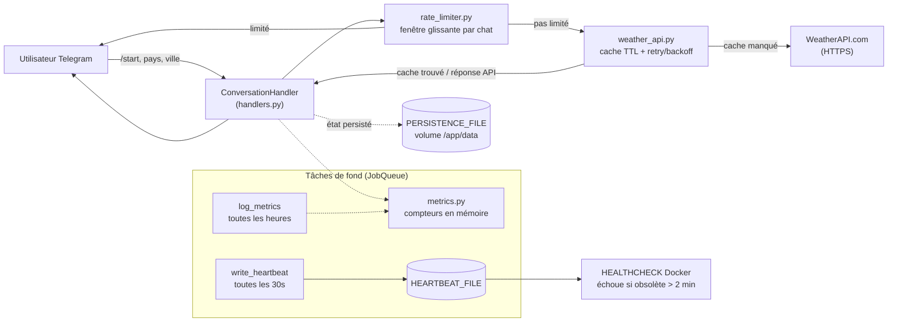

# 🌤️ Bot Météo Telegram

🇬🇧 [English version](./README.md)

[](https://github.com/Alithiel31/WeatherTelegramBot/actions/workflows/ci.yml)

Un bot Telegram léger et asynchrone, écrit en Python, qui fournit la météo en temps réel via WeatherAPI. L'utilisateur envoie un pays puis une ville, et reçoit instantanément la température, les conditions, l'humidité et la vitesse du vent.

## Table des matières

- [Stack & compétences](#stack--compétences)
- [Architecture](#architecture)
- [Fonctionnalités](#fonctionnalités)
- [Installation & configuration](#installation--configuration)
- [Utilisation](#utilisation)
- [Docker](#docker)
- [Tests & Linting](#tests--linting)
- [Structure du projet](#structure-du-projet)
- [Détails techniques](#détails-techniques)
- [Dépannage](#dépannage)
- [Contribuer](#contribuer)
- [Licence](#licence)

## Stack & compétences

Ce projet couvre, de bout en bout :

- **Python asynchrone** : `python-telegram-bot` v20+ (`ApplicationBuilder`, `ConversationHandler`, `JobQueue`), `httpx` pour des appels HTTP non bloquants
- **Résilience** : retry avec backoff exponentiel sur les erreurs réseau transitoires, rate limiting par chat (fenêtre glissante), cache TTL borné (`cachetools`) pour réduire les appels API redondants
- **Observabilité** : compteurs de métriques en mémoire thread-safe (requêtes, cache hits, erreurs, rate-limited) journalisés périodiquement, `HEALTHCHECK` Docker basé sur un heartbeat d'activité réel plutôt que sur la simple présence du process
- **État & persistance** : l'état de conversation (`PicklePersistence`) survit aux redémarrages du bot si le fichier de persistance est sur un volume monté
- **Conteneurisation & sécurité** : utilisateur non-root dans Docker, secrets hors du dépôt (`.env`), dépendances figées avec mises à jour automatiques (Dependabot) et scan de vulnérabilités (`pip-audit`)
- **CI/CD & qualité** : GitHub Actions (lint, vérification de types, tests avec un seuil de couverture de 90 %, audit des dépendances, build Docker), hooks `pre-commit` pour reproduire les mêmes vérifications en local
- **Documentation** : README/CONTRIBUTING/Troubleshooting bilingues, changelog versionné ([Keep a Changelog](https://keepachangelog.com/en/1.0.0/))

## Architecture



`handlers.py` est la couche de présentation (dialogue avec Telegram), `services/` contient la logique métier indépendante du framework, `config.py` centralise les variables d'environnement. Le fichier heartbeat et le fichier de persistance doivent tous deux vivre sur un chemin qui survit à la recréation du container — voir [`Troubleshooting.fr.md`](./docs/Troubleshooting.fr.md) pour ce qui se passe sinon.

## Fonctionnalités

- Données en temps réel : récupère la météo actuelle via WeatherAPI (HTTPS).
- Localisé : descriptions météo fournies en français (lang=fr).
- Simple d'utilisation : interface textuelle simple (pas de commandes complexes).
- Gestion robuste des erreurs : timeouts API, noms de ville invalides, clés API invalides (401/403), et limites de débit du fournisseur (429) gérés proprement.
- Retry automatique avec backoff exponentiel sur les erreurs réseau transitoires.
- Rate limiting par chat pour prévenir les abus et maîtriser les coûts d'API.
- Validation des entrées sur les messages pays/ville.
- Asynchrone : construit sur python-telegram-bot pour de bonnes performances.
- Cache TTL borné (cachetools) pour éviter les appels API redondants sur une même ville.
- Timeout automatique de conversation pour éviter les sessions bloquées.
- Métriques basiques en mémoire (requêtes, cache hits, erreurs, rate-limited) journalisées périodiquement.
- Healthcheck Docker basé sur un heartbeat d'activité réel, pas seulement la présence du process.
- État de conversation persisté sur disque (survit aux redémarrages du bot si le fichier est sur un volume monté).
- Le container tourne avec un utilisateur non-root.

## Installation & configuration

### 1. Prérequis

- Python 3.10+
- Un token de bot Telegram (via @BotFather)
- Une clé API WeatherAPI (via WeatherAPI.com)

### 2. Cloner le dépôt

```bash
git clone https://github.com/<votre-nom-utilisateur>/WeatherTelegramBot.git
cd WeatherTelegramBot
```

### 3. Installer les dépendances

```bash
pip install -r requirements.txt
```

### 4. Configuration

Copiez `.env.example` vers `.env` et renseignez vos identifiants :

```bash
cp .env.example .env
```

```text
TELEGRAM_TOKEN=votre_token_bot_telegram
WEATHER_API_KEY=votre_cle_weatherapi
```

Variables de réglage optionnelles (des valeurs par défaut raisonnables sont utilisées si omises) :

```text
CONVERSATION_TIMEOUT=300           # secondes avant fermeture d'une conversation inactive
WEATHER_CACHE_TTL=600               # secondes de validité d'un résultat météo en cache
WEATHER_CACHE_MAXSIZE=500           # nb max d'entrées ville/pays distinctes en cache
RATE_LIMIT_MAX_REQUESTS=5           # nb max de requêtes météo par chat et par fenêtre
RATE_LIMIT_WINDOW_SECONDS=60        # taille de la fenêtre glissante du rate limiting
MAX_INPUT_LENGTH=60                 # nb max de caractères acceptés pour pays/ville
FETCH_MAX_RETRIES=3                 # nb de tentatives sur erreurs réseau transitoires
FETCH_RETRY_BACKOFF_BASE=0.5        # délai de base (secondes) du backoff exponentiel
METRICS_LOG_INTERVAL_SECONDS=3600   # fréquence de journalisation des métriques
HEARTBEAT_FILE=/tmp/bot_heartbeat   # fichier heartbeat utilisé par le healthcheck Docker
HEARTBEAT_INTERVAL_SECONDS=30       # fréquence de mise à jour du heartbeat
PERSISTENCE_FILE=bot_persistence.pickle  # où les conversations en cours sont sauvegardées
```

> Si vous surchargez `HEARTBEAT_FILE` ou `PERSISTENCE_FILE` en dehors de Docker (`docker-compose.yml` gère déjà correctement le cas standard), assurez-vous que le nouveau chemin est accessible en écriture et, pour `PERSISTENCE_FILE`, réellement persisté entre les redémarrages — voir [`Troubleshooting.fr.md`](./docs/Troubleshooting.fr.md).

## Utilisation

Lancer le bot :

```bash
python main.py
```

Comment interagir avec le bot :

1. Ouvrez Telegram et cherchez votre bot.
2. Appuyez sur /start.
3. Tapez un pays, puis un nom de ville (ex : France → Paris).
4. Recevez instantanément un rapport météo formaté !

## Docker

```bash
docker compose up --build -d
```

`docker-compose.yml` monte un volume nommé sur `/app/data`, où `PERSISTENCE_FILE` vit par défaut dans l'image — c'est ce qui permet à l'état de conversation et au heartbeat du healthcheck de survivre à un redémarrage du container.

## Tests & Linting

```bash
pytest                                 # exécute les tests + couverture (min. 90% sur weather_bot/)
black --check .
flake8 . --max-line-length=88
mypy --ignore-missing-imports .
pip-audit -r requirements.txt
```

Pour exécuter automatiquement ces mêmes vérifications avant chaque commit :

```bash
pip install pre-commit
pre-commit install
```

Voir [`CONTRIBUTING.fr.md`](./docs/CONTRIBUTING.fr.md) pour le workflow de développement local complet.

## Structure du projet

L'application suit une architecture en couches légère : `handlers.py` est la couche de présentation (dialogue avec Telegram), `services/` contient la logique métier indépendante du framework, `config.py` est la configuration partagée. `main.py` reste à la racine du dépôt comme point d'entrée.

```text
WeatherTelegramBot/
├── main.py                    # Démarrage du bot : app, conversation handler, tâches de fond
├── weather_bot/
│   ├── config.py              # Variables d'environnement et constantes de configuration
│   ├── handlers.py            # Handlers de conversation Telegram (start, get_country, ...)
│   └── services/
│       ├── weather_api.py     # Client WeatherAPI (fetch async, cache TTL, retry/backoff)
│       ├── rate_limiter.py    # Rate limiter par chat (fenêtre glissante)
│       └── metrics.py         # Compteurs en mémoire thread-safe
├── tests/                     # Tests unitaires miroir de la structure du package
├── .env                       # Variables d'environnement (ignoré par git, voir .env.example)
├── requirements.txt           # Dépendances Python figées
├── pytest.ini                 # Config des tests : pythonpath + seuil de couverture
├── .pre-commit-config.yaml    # Hooks pre-commit locaux (black, flake8, mypy)
└── .github/
    ├── workflows/ci.yml       # CI : lint, vérification de types, tests, audit dépendances, build Docker
    └── dependabot.yml         # PR automatiques de mise à jour des dépendances (pip, GitHub Actions, Docker)
```

## Détails techniques

Le bot utilise le pattern `ApplicationBuilder` de python-telegram-bot v20+. Il inclut une action de chat « en train d'écrire » pour améliorer l'expérience utilisateur pendant la récupération des données depuis l'API externe, un cache TTL borné en mémoire (`cachetools`) pour réduire les appels API redondants, un retry automatique avec backoff exponentiel sur les échecs réseau transitoires, un rate limiting par chat, et un timeout de conversation pour fermer automatiquement les sessions inactives. Une tâche `JobQueue` de fond écrit un fichier heartbeat utilisé par le `HEALTHCHECK` Docker pour confirmer que le bot est réellement actif (pas seulement que le process existe), et journalise périodiquement des métriques d'usage basiques. L'état de conversation est persisté via `PicklePersistence`, de sorte qu'un flux `/start` en cours survit à un redémarrage du bot, à condition que `PERSISTENCE_FILE` pointe vers un volume monté (voir `docker-compose.yml`). L'image Docker abandonne les privilèges root avant de lancer le bot.

## Dépannage

Deux pièges de configuration ont été identifiés et corrigés lors du durcissement du projet (chemin du healthcheck désynchronisé, état de conversation perdu à la recréation du container) — voir [`Troubleshooting.fr.md`](./docs/Troubleshooting.fr.md) pour le diagnostic complet si vous rencontrez un problème similaire après avoir modifié `HEARTBEAT_FILE` ou `PERSISTENCE_FILE`.

## Contribuer

Voir [`CONTRIBUTING.fr.md`](./docs/CONTRIBUTING.fr.md) pour l'environnement de développement, comment reproduire les vérifications de la CI en local, et le format des PR.

## Licence

Ce projet est distribué sous licence [MIT](./LICENSE).
