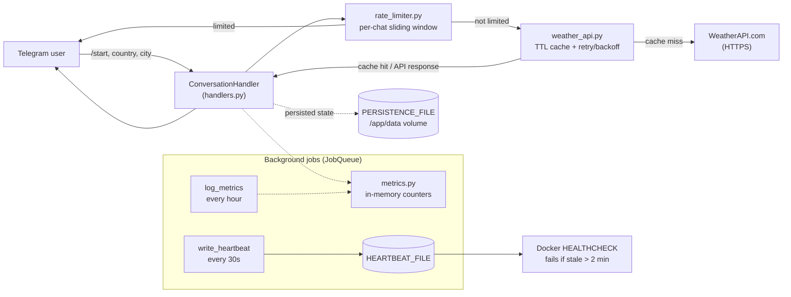

# 🌤️ Telegram Weather Bot

🇫🇷 [Version française](./README.fr.md)

[](https://github.com/Alithiel31/WeatherTelegramBot/actions/workflows/ci.yml)

A lightweight, asynchronous Telegram bot built with Python that provides real-time weather updates using the WeatherAPI. Users send a country then a city name and receive instant data on temperature, conditions, humidity, and wind speed.

## Table of contents

- [Stack & skills](#stack--skills)
- [Architecture](#architecture)
- [Features](#features)
- [Installation & Setup](#installation--setup)
- [Usage](#usage)
- [Docker](#docker)
- [Tests & Linting](#tests--linting)
- [Project Structure](#project-structure)
- [Technical Details](#technical-details)
- [Troubleshooting](#troubleshooting)
- [Contributing](#contributing)
- [License](#license)

## Stack & skills

This project covers, end to end:

- **Async Python**: `python-telegram-bot` v20+ (`ApplicationBuilder`, `ConversationHandler`, `JobQueue`), `httpx` for non-blocking HTTP calls
- **Resilience**: retry with exponential backoff on transient network errors, per-chat sliding-window rate limiting, bounded TTL cache (`cachetools`) to cut redundant API calls
- **Observability**: thread-safe in-memory metrics (requests, cache hits, errors, rate-limited) logged periodically, Docker `HEALTHCHECK` driven by a real activity heartbeat rather than process presence
- **State & persistence**: conversation state (`PicklePersistence`) survives bot restarts when the persistence file lives on a mounted volume
- **Containerization & security**: non-root Docker user, secrets kept outside the repo (`.env`), pinned dependencies with automated updates (Dependabot) and vulnerability scanning (`pip-audit`)
- **CI/CD & quality**: GitHub Actions (lint, type-check, tests with a 90% coverage floor, dependency audit, Docker build), `pre-commit` hooks to reproduce the same checks locally
- **Documentation**: bilingual README/CONTRIBUTING/Troubleshooting, versioned changelog ([Keep a Changelog](https://keepachangelog.com/en/1.0.0/))

## Architecture



`handlers.py` is the presentation layer (talks to Telegram), `services/` is framework-agnostic business logic, `config.py` centralizes environment variables. The heartbeat file and the persistence file both need to live under a path that survives container recreation — see [`Troubleshooting.md`](./docs/Troubleshooting.md) for what happens when they don't.

## Features

- Real-time Data: Fetches current weather via WeatherAPI (HTTPS).
- Localized: Weather descriptions provided in French (lang=fr).
- User Friendly: Simple text-based interface (no complex commands needed).
- Robust Error Handling: Manages API timeouts, invalid city names, invalid API keys (401/403), and provider rate limits (429) gracefully.
- Automatic retry with exponential backoff on transient network errors.
- Per-chat rate limiting to prevent abuse and control API costs.
- Input validation on country/city messages.
- Asynchronous: Built on python-telegram-bot for efficient performance.
- Bounded TTL caching (cachetools) to avoid redundant API calls for the same city.
- Conversation auto-timeout to avoid stuck sessions.
- Basic in-memory metrics (requests, cache hits, errors, rate-limited) logged periodically.
- Docker healthcheck based on a real activity heartbeat, not just process presence.
- Conversation state persisted to disk (survives bot restarts when the file is on a mounted volume).
- Container runs as a non-root user.

## Installation & Setup

### 1. Prerequisites

- Python 3.10+
- A Telegram Bot Token (from @BotFather)
- A WeatherAPI Key (from WeatherAPI.com)

### 2. Clone the Repository

```bash
git clone https://github.com/<your-username>/WeatherTelegramBot.git
cd WeatherTelegramBot
```

### 3. Install Dependencies

```bash
pip install -r requirements.txt
```

### 4. Configuration

Copy `.env.example` to `.env` and add your credentials:

```bash
cp .env.example .env
```

```text
TELEGRAM_TOKEN=your_telegram_bot_token_here
WEATHER_API_KEY=your_weatherapi_key_here
```

Optional tuning variables (sensible defaults are used if omitted):

```text
CONVERSATION_TIMEOUT=300           # seconds before an inactive conversation closes
WEATHER_CACHE_TTL=600               # seconds a cached weather result stays valid
WEATHER_CACHE_MAXSIZE=500           # max distinct city/country entries cached
RATE_LIMIT_MAX_REQUESTS=5           # max weather requests per chat per window
RATE_LIMIT_WINDOW_SECONDS=60        # sliding window size for rate limiting
MAX_INPUT_LENGTH=60                 # max characters accepted for country/city input
FETCH_MAX_RETRIES=3                 # retry attempts on transient network errors
FETCH_RETRY_BACKOFF_BASE=0.5        # base delay (seconds) for exponential backoff
METRICS_LOG_INTERVAL_SECONDS=3600   # how often metrics are logged
HEARTBEAT_FILE=/tmp/bot_heartbeat   # heartbeat file used by the Docker healthcheck
HEARTBEAT_INTERVAL_SECONDS=30       # how often the heartbeat file is updated
PERSISTENCE_FILE=bot_persistence.pickle  # where in-progress conversations are saved
```

> If you override `HEARTBEAT_FILE` or `PERSISTENCE_FILE` when running outside Docker (`docker-compose.yml` already handles this correctly), make sure the new path is writable and, for `PERSISTENCE_FILE`, actually persisted across restarts — see [`Troubleshooting.md`](./docs/Troubleshooting.md).

## Usage

Run the bot using:

```bash
python main.py
```

How to interact with the bot:

1. Open Telegram and search for your bot.
2. Press /start.
3. Type a country, then a city name (e.g., France → Paris).
4. Receive a formatted weather report instantly!

## Docker

```bash
docker compose up --build -d
```

`docker-compose.yml` mounts a named volume at `/app/data`, where `PERSISTENCE_FILE` lives by default in the image — this is what makes conversation state and the healthcheck heartbeat survive a container restart.

## Tests & Linting

```bash
pytest                                 # runs tests + coverage (min. 90% on weather_bot/)
black --check .
flake8 . --max-line-length=88
mypy --ignore-missing-imports .
pip-audit -r requirements.txt
```

To run the same checks automatically before every commit:

```bash
pip install pre-commit
pre-commit install
```

See [`CONTRIBUTING.md`](./docs/CONTRIBUTING.md) for the full local development workflow.

## Project Structure

The app follows a light layered structure: `handlers.py` is the presentation layer (talks to Telegram), `services/` is framework-agnostic business logic, `config.py` is shared configuration. `main.py` stays at the repository root as the entry point.

```text
WeatherTelegramBot/
├── main.py                    # Bot bootstrap: app, conversation handler, background jobs
├── weather_bot/
│   ├── config.py              # Environment variables and configuration constants
│   ├── handlers.py            # Telegram conversation handlers (start, get_country, ...)
│   └── services/
│       ├── weather_api.py     # WeatherAPI client (async fetch, TTL cache, retry/backoff)
│       ├── rate_limiter.py    # Per-chat sliding-window rate limiter
│       └── metrics.py         # Thread-safe in-memory counters
├── tests/                     # Unit tests mirroring the package layout
├── .env                       # Environment variables (ignored by git, see .env.example)
├── requirements.txt           # Pinned Python dependencies
├── pytest.ini                 # Test config: pythonpath + coverage threshold
├── .pre-commit-config.yaml    # Local pre-commit hooks (black, flake8, mypy)
└── .github/
    ├── workflows/ci.yml       # CI: lint, type-check, tests, dependency audit, Docker build
    └── dependabot.yml         # Automated dependency update PRs (pip, GitHub Actions, Docker)
```

## Technical Details

The bot uses the `ApplicationBuilder` pattern from python-telegram-bot v20+. It includes a "typing" chat action to improve user experience while fetching data from the external API, a bounded in-memory TTL cache (`cachetools`) to reduce redundant API calls, automatic retry with exponential backoff on transient network failures, per-chat rate limiting, and a conversation timeout to automatically close inactive sessions. A background `JobQueue` job writes a heartbeat file used by the Docker `HEALTHCHECK` to confirm the bot is actually alive (not just that the process exists), and periodically logs basic usage metrics. Conversation state is persisted via `PicklePersistence` so an in-progress `/start` flow survives a bot restart, provided `PERSISTENCE_FILE` points to a mounted volume (see `docker-compose.yml`). The Docker image drops root privileges before running the bot.

## Troubleshooting

Two configuration pitfalls were found and fixed during hardening (mismatched healthcheck path, conversation state lost on container recreation) — see [`Troubleshooting.md`](./docs/Troubleshooting.md) for the full diagnosis if you hit something similar after changing `HEARTBEAT_FILE` or `PERSISTENCE_FILE`.

## Contributing

See [`CONTRIBUTING.md`](./docs/CONTRIBUTING.md) for the development environment, how to reproduce the CI checks locally, and the PR format.

## License

This project is licensed under the [MIT](./LICENSE) license.
